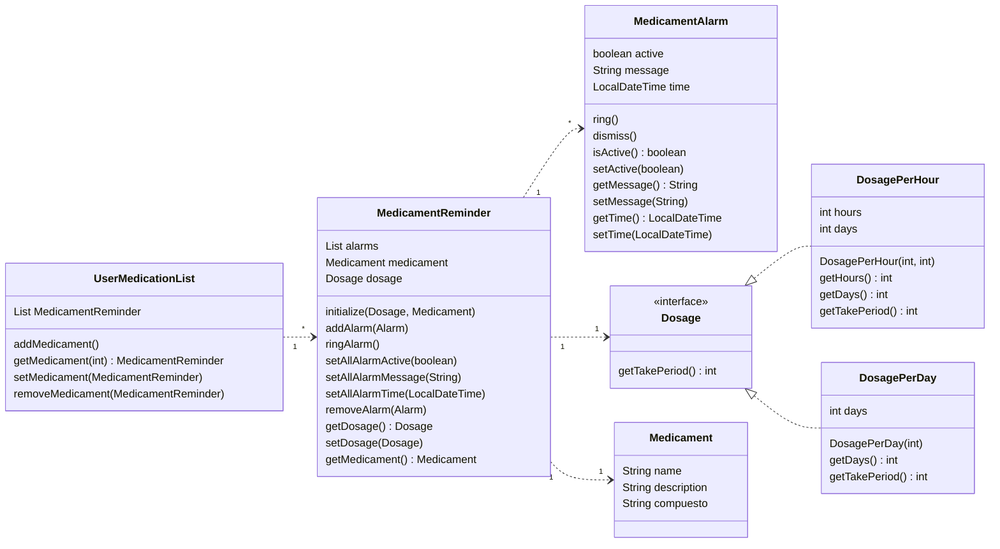

# Abstraction

## Class Diagram

```mermaid
    classDiagram
    direction LR
    UserMedicationList "1" ..> "*" MedicamentReminder
    MedicamentReminder "1" ..> "*" MedicamentAlarm 
    MedicamentReminder "1" ..> "1" Dosage
    MedicamentReminder "1" ..> "1" Medicament
    
    Dosage <|.. DosagePerHour
    Dosage <|.. DosagePerDay


    class UserMedicationList{
        List MedicamentReminder

        addMedicament()
        getMedicament(int) MedicamentReminder
        setMedicament(MedicamentReminder)
        removeMedicament(MedicamentReminder)

    }

    class MedicamentReminder{
        List alarms
        Medicament medicament
        Dosage dosage

        initialize(Dosage, Medicament) 

        addAlarm(Alarm)
        ringAlarm()

        setAllAlarmActive(boolean)
        setAllAlarmMessage(String)
        setAllAlarmTime(LocalDateTime)
        
        removeAlarm(Alarm)

        getDosage() Dosage
        setDosage(Dosage) 

        getMedicament() Medicament
    }

    class MedicamentAlarm{
        boolean active
        String message
        LocalDateTime time

        ring()
        dismiss() 

        isActive() boolean
        setActive(boolean)

        getMessage() String
        setMessage(String)

        getTime() LocalDateTime
        setTime(LocalDateTime) 
    }


    class Dosage{
        getTakePeriod() int
    }

    <<interface>> Dosage

    class DosagePerHour{
        int hours
        int days

        DosagePerHour(int, int)

        getHours() int
        getDays() int

        getTakePeriod() int
    }

    class DosagePerDay{
        int days

        DosagePerDay(int)
        getDays() int

        getTakePeriod() int
    }

    class Medicament{
        String name
        String description
        String compuesto
    }


```
