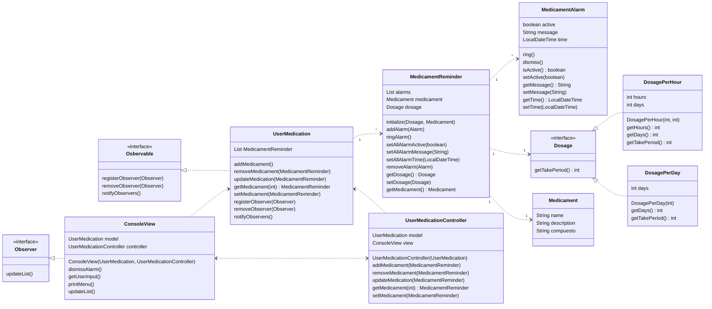

# Abstraction

## Class Diagram

```mermaid
classDiagram
    direction LR
    UserMedication "1" ..> "*" MedicamentReminder
    MedicamentReminder "1" ..> "*" MedicamentAlarm 
    MedicamentReminder "1" ..> "1" Dosage
    MedicamentReminder "1" ..> "1" Medicament
    
    Dosage <|.. DosagePerHour
    Dosage <|.. DosagePerDay


    class UserMedication{
        List MedicamentReminder

        addMedicament()
        removeMedicament(MedicamentReminder)
        updateMedication(MedicamentReminder)
        getMedicament(int) MedicamentReminder
        setMedicament(MedicamentReminder)

        registerObserver(Observer)
        removeObserver(Observer)
        notifyObservers()
    }

    class MedicamentReminder{
        List alarms
        Medicament medicament
        Dosage dosage

        initialize(Dosage, Medicament) 

        addAlarm(Alarm)
        ringAlarm()

        setAllAlarmActive(boolean)
        setAllAlarmMessage(String)
        setAllAlarmTime(LocalDateTime)
        
        removeAlarm(Alarm)

        getDosage() Dosage
        setDosage(Dosage) 

        getMedicament() Medicament
    }

    class MedicamentAlarm{
        boolean active
        String message
        LocalDateTime time

        ring()
        dismiss() 

        isActive() boolean
        setActive(boolean)

        getMessage() String
        setMessage(String)

        getTime() LocalDateTime
        setTime(LocalDateTime) 
    }


    class Dosage{
        getTakePeriod() int
    }

    <<interface>> Dosage

    class DosagePerHour{
        int hours
        int days

        DosagePerHour(int, int)

        getHours() int
        getDays() int

        getTakePeriod() int
    }

    class DosagePerDay{
        int days

        DosagePerDay(int)
        getDays() int

        getTakePeriod() int
    }

    class Medicament{
        String name
        String description
        String compuesto
    }

    Osbervable <|.. UserMedication
    Observer <|.. ConsoleView

    UserMedication<..UserMedicationController
    ConsoleView<..>UserMedicationController

    ConsoleView..>UserMedication


    class Osbervable {
        registerObserver(Observer)
        removeObserver(Observer)
        notifyObservers()
    }
    <<interface>> Osbervable

    class Observer{
        updateList()
    }
    <<interface>> Observer

    class UserMedicationController{
        UserMedication model
        ConsoleView view

        UserMedicationController(UserMedication)

        addMedicament(MedicamentReminder)
        removeMedicament(MedicamentReminder)
        updateMedication(MedicamentReminder)
        getMedicament(int) MedicamentReminder
        setMedicament(MedicamentReminder)

    }

    class ConsoleView{
        UserMedication model
        UserMedicationController controller

        ConsoleView(UserMedication, UserMedicationController)

        dismissAlarm()
        getUserInput()
        printMenu()
        updateList()
    }

```
