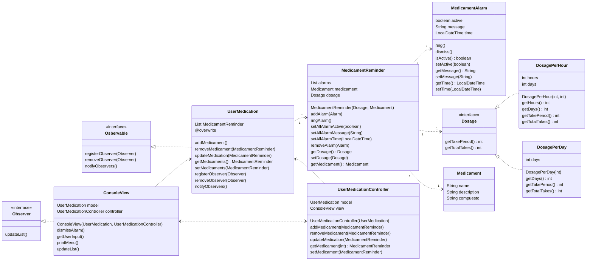
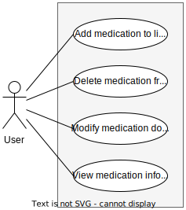
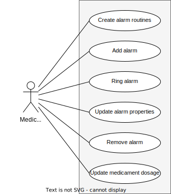
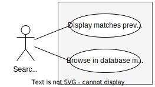

# Artifacts

## Class Diagram

## Use cases

### User

### User Medication

### Medicament Reminder

### Search system

## User stories with acceptance criteria

### User Story 1

As a user, I want to add medications to my list to keep track of my treatment.

**Acceptance Criteria:**

- I can add medications to the list by clicking on a designated button and receive a confirmation message or an error message in case of failure.
- The list updates instantly to display the added medications, and visually confirming that the medications are present.
- I can view details of the added medications, including their name and dosage, and this information is clear and legible.

### User Story 2

As a user, I want to easily search for and select medications.

**Acceptance Criteria:**

- When I click the button to add medications, it turns into a search bar, and the transition is confirmed or an error message is received in case of failure.
- Typing characters in the search bar displays up to 5 matching results, and visually confirming the match.
- I can select a medication from the list of results and add it to my list, receiving a confirmation or an error message in case of failure.

### User Story 3

As a user, I want to schedule dosage times for my medications.

**Acceptance Criteria:**

- After adding a medication to the list, I can set specific dosage schedules and receive a confirmation or an error message in case of failure.
- I can set the dosage frequency, either by hours or days, visually confirming the configuration.
- If I choose dosage by hours, I can enter the repetition duration (days or weeks), and receive confirmation or an error message in case of failure.
- If I choose dosage by days, I can enter the number of repetitions, and receive confirmation or an error message in case of failure.

### User Story 4

As a user, I want to receive reminders to take my medications.

**Acceptance Criteria:**

- The program creates calendar alarms for medication doses, and the creation of each alarm is verified.
- When an alarm sounds, a visual notification screen is displayed, visually confirming the appearance of the notification.
- An alarm sound is emitted when the notification is shown, and auditory confirmation of the sound emission.

### User Story 5

As a user, I want to view a calendar with highlighted dates for my medication doses.

**Acceptance Criteria:**

- I can view a monthly calendar that shows highlighted dates for when I should take my medications, visually confirming the highlighting.
- Medication names are clearly and legibly displayed on the calendar, and visually confirming the readability.
- I can click on a date in the calendar to view details of the scheduled doses for that day, and verifying the display of details.
