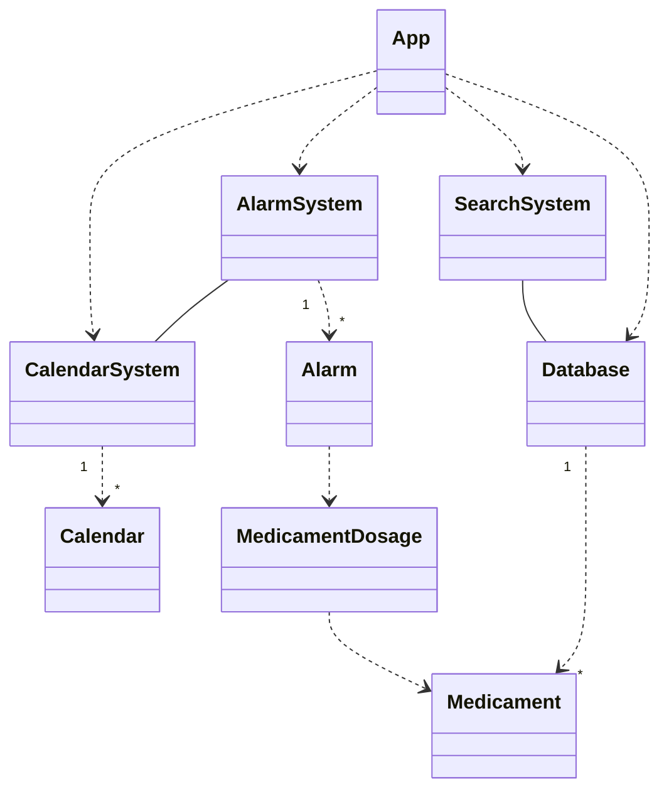

# Abstraction

TODO:

Se incluye una versión inicial del Diagrama de Clases. Se establecen algunas relaciones y tipos de asociaciones. Existe una forma de verificar la correspondencia de las clases con respecto a los rrequisitos. Opcional: Se incluyen diagramas de secuencia para complementar la especificación de los RF.

## Class Diagram

