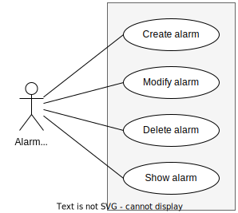
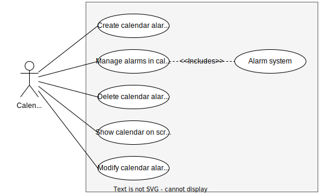

# Artifacts

Artefactos: Se incluyen como evidencia artefactos que especifican los Requisitos, incluye excepciones a considerar (*casos de uso, historias de usuario con criterios de aceptación). Se presenta un diagrama que resume el conjunto de requisitos (ej. Diagrama de Casos de Uso).

## Use cases

### User

### Alarm system

### Calendar system

## User stories with acceptance criteria
